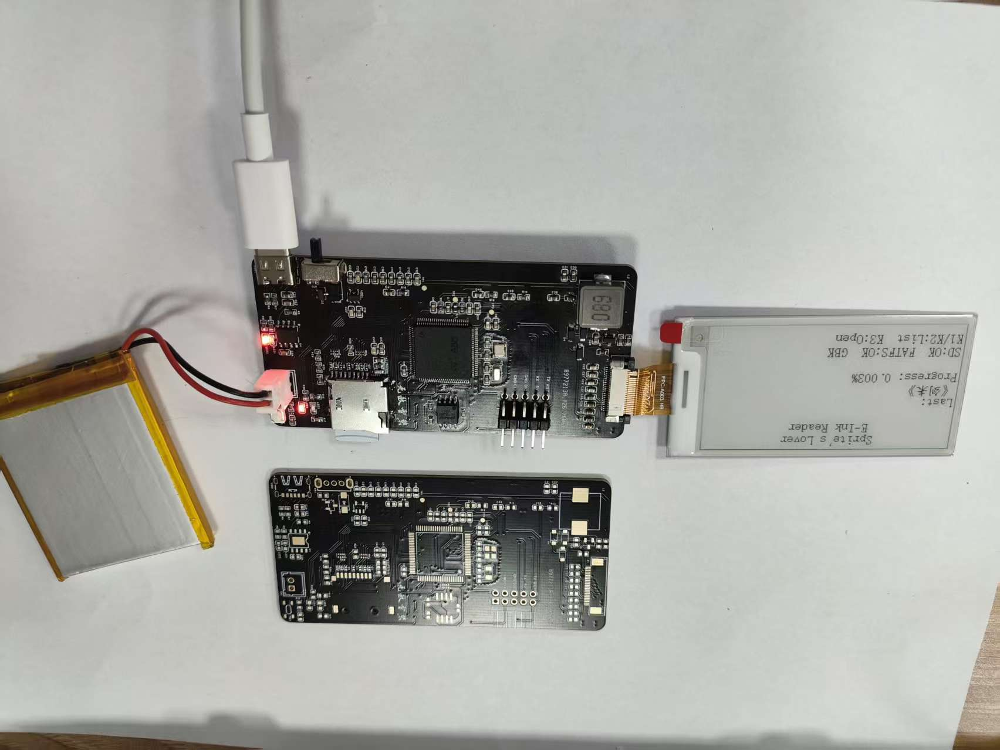
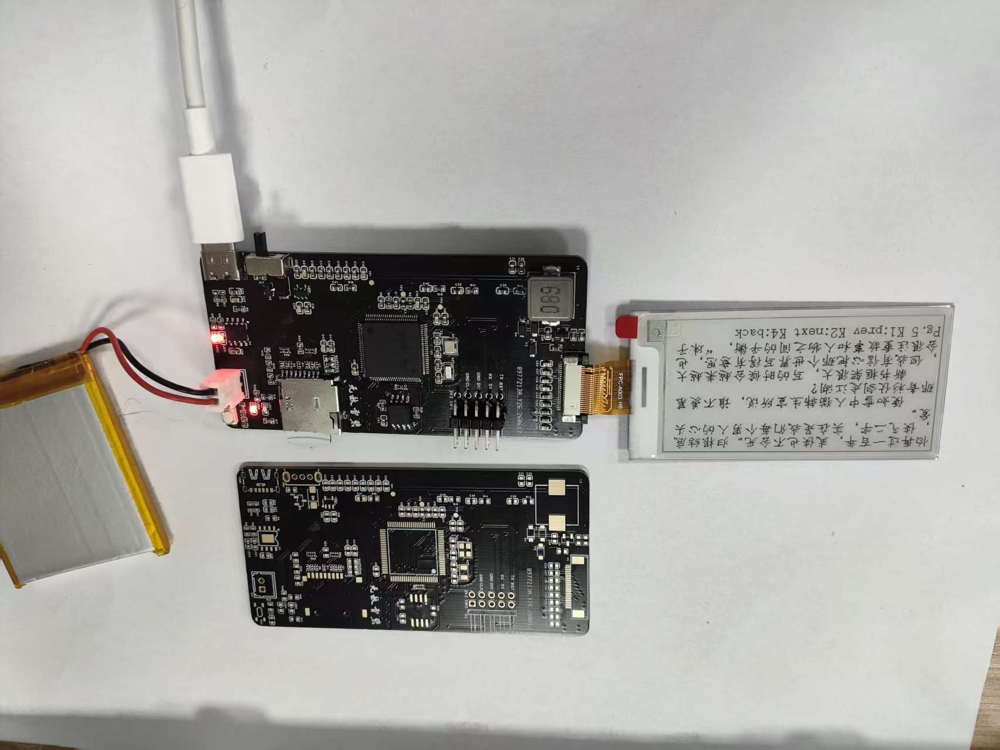

# STM32 水墨屏阅读器项目

这是一个基于 STM32F407 的嵌入式水墨屏阅读器项目。项目目标是做一块可以独立运行的电子墨水阅读设备：从 SD 卡读取 TXT 文本，通过 FatFS 管理文件系统，在 2.66 英寸黑白水墨屏上显示书架、阅读页面和阅读进度，并使用 FreeRTOS 对按键、屏幕刷新、文件读取、调试日志等模块进行任务化管理。

这个仓库不仅包含软件代码，也包含硬件 PCB 设计资料。硬件部分把主控、SD 卡、W25Q128 字库 Flash、水墨屏驱动电路、充电电路、USB 供电/下载接口等集成到一块板子上，适合作为嵌入式综合项目、作品集项目或 FreeRTOS + 文件系统 + 显示驱动学习案例。

## 项目展示

> 
>

## 项目特点

- 基于 STM32F407，使用 STM32CubeMX 生成 HAL 工程，并通过 CMake 构建。
- 引入 FreeRTOS/CMSIS-RTOS v2，将按键扫描、屏幕刷新、应用逻辑、调试日志拆分为独立任务。
- 使用 FatFS 挂载 SD 卡，在 `0:/ebooks` 目录下扫描和读取电子书文件。
- 支持水墨屏全刷、局部刷新和深度睡眠，阅读翻页时优先使用局部刷新提升响应速度。
- 使用 W25Q128 外部 Flash 保存字库和阅读进度相关数据。
- 阅读进度保存采用双扇区镜像、递增序号和 CRC32 校验，降低掉电写坏数据的风险。
- 实现 GBK/ASCII 文本解析、自动换行和 16x16 点阵字显示，适合中文 TXT 阅读。
- 硬件上集成锂电池充电、USB 供电、SD 卡、水墨屏接口、主控和下载调试接口，便于做成完整手持设备。

## 硬件组成

| 模块 | 说明 |
| --- | --- |
| 主控 | STM32F407 系列 MCU，负责 FreeRTOS 调度、文件系统、屏幕刷新和外设控制 |
| 显示 | 2.66 英寸黑白水墨屏，分辨率 152 x 296，驱动兼容 SSD1681 类控制器 |
| 存储 | SD/TF 卡用于存放电子书文件，W25Q128 用于字库和持久化数据 |
| 电源 | 支持锂电池供电和 USB 供电 |
| 充电 | USB 插入时可给系统供电，同时给锂电池充电 |
| 调试下载 | 预留 SWD 下载调试接口，便于烧录和在线调试 |
| 交互 | 多按键输入，用于书架选择、翻页、打开文件和返回 |

硬件设计资料位于 `02_Hardware_PCB`，其中包含原理图、Gerber 和立创/Altium 相关工程文件。

## 软件架构

主工程位于：

```text
04_FreeRTOS_Integration/Wash_Ink_Screen
```

核心软件分层如下：

```text
Core/                       STM32CubeMX 生成的启动、时钟、GPIO、SPI、SDIO、DMA、USART 等初始化代码
FATFS/                      FatFS 组件和 SD 卡文件系统适配
Middlewares/                FreeRTOS、FatFS 等第三方中间件
User/App/                   应用层：任务创建、IPC、书架、阅读器、书签、调试日志
User/BSP/                   板级支持包：SPI、GPIO、UART、Delay 等封装
User/Drivers/EPD            水墨屏驱动和基础 GUI 绘制
User/Drivers/Key            按键扫描与短按/长按事件识别
User/Drivers/SD             SD 卡检测、挂载、文件读取封装
User/Drivers/W25Q128        W25Q128 外部 Flash 读写、擦除和 JEDEC ID 读取
User/DriverTests            EPD、Key、SD、W25Q128 单模块测试代码
```

### FreeRTOS 任务划分

| 任务 | 优先级 | 主要职责 |
| --- | --- | --- |
| `defaultTask` / `App_Task` | Normal | 应用主逻辑：主页、书架、阅读器、阅读进度恢复与保存 |
| `KeyTask` | AboveNormal | 每 10 ms 扫描按键，生成短按/长按事件并写入按键消息队列 |
| `EPDTask` | Normal | 接收屏幕命令，执行水墨屏唤醒、全刷、局刷和休眠 |
| `DBGTask` | Low | 异步输出调试日志，减少串口打印对主逻辑的阻塞 |

任务之间通过 CMSIS-RTOS v2 的消息队列和信号量通信：

- `g_key_queue`：按键任务向应用任务发送按键事件。
- `g_epd_queue`：应用任务向屏幕任务发送刷新命令。
- `g_epd_done`：屏幕任务刷新完成后通知应用任务，保证帧缓冲区不会被提前覆盖。

这种设计把耗时的水墨屏刷新从应用逻辑中拆出来，按键扫描也不会因为屏幕刷新或 SD 卡读取而丢事件。

## 阅读器功能

当前主工程已经实现了一个可运行的本地 TXT 阅读流程：

1. 上电后初始化外设、FreeRTOS、FatFS、SPI DMA 信号量和应用任务。
2. 首页显示项目名称、SD 卡状态、最近阅读文件和阅读进度。
3. 从 SD 卡 `0:/ebooks` 目录扫描文件，生成书架列表。
4. 通过按键在书架中上下选择文件，并打开进入阅读界面。
5. 阅读界面按页渲染文本，支持上一页、下一页、返回书架。
6. 首次显示使用全刷，后续翻页使用局部刷新，减少闪烁和等待。
7. 退出阅读时保存当前文件偏移量，下次打开可恢复到上次位置。
8. 删除 SD 卡文件后，书签表会清理不存在文件对应的记录。

## 关键实现点

### 1. FatFS + SD 卡文件系统

项目通过 SDIO 接入 SD/TF 卡，并使用 FatFS 读取文件。应用层会挂载 SD 卡，扫描 `0:/ebooks` 下的文件列表，再按需打开文件读取内容。读取文本时使用 512 字节缓冲，减少频繁文件 IO。

### 2. 水墨屏驱动和局部刷新

水墨屏驱动位于 `User/Drivers/EPD`，帧缓冲大小为 `(152 / 8) * 296 = 5624` 字节。应用层先在 RAM 中绘制完整页面，再交给 `EPDTask` 推送到屏幕。书架光标移动和阅读翻页使用局部刷新，首页、首次进阅读页等场景使用全刷来清除残影。

### 3. 中文文本显示

阅读器按字节解析文本，识别 ASCII 和 GBK 双字节中文字符。英文字符按 8 像素宽度计算，中文字符按 16 像素宽度计算，超过屏幕宽度后自动换行。配合 W25Q128 中提前烧录的字库，可以显示中文 TXT 内容。

### 4. 阅读进度掉电保存

阅读进度保存在 W25Q128 中，不依赖 SD 卡额外生成配置文件。书签模块为每条记录保存文件路径和字节偏移量，并使用两个 Flash 扇区做镜像：每次提交写入非活动扇区，写入成功后切换活动镜像。镜像头包含 magic、序号和 CRC32，启动时自动选择最新且校验通过的数据。

### 5. BSP 与驱动分层

底层外设初始化由 CubeMX 生成，用户代码通过 BSP 层访问 SPI、GPIO、UART 和 Delay。EPD、SD、Key、W25Q128 等模块不直接堆在应用逻辑里，便于单独测试和后续替换硬件。

## 目录说明

```text
01_Doc/                         项目文档、说明资料、后续可放实物照片
02_Hardware_PCB/                硬件原理图、PCB 工程、Gerber 文件
03_Software_Single_Project/     早期单功能验证工程，例如 SD 卡 FatFS、外设测试等
04_FreeRTOS_Integration/        FreeRTOS 集成版主工程
  Wash_Ink_Screen/              当前主要工程：本地 SD 卡水墨屏阅读器
  Wash_Ink_Screen_Internet/     后续网络扩展工程：配合 ESP32/服务器/微信小程序使用
E_ink_download_app_wx/          微信小程序端，用于后续文件上传、设备文件管理等功能
README.md                       项目总说明
```

## 快速使用

### 1. 准备硬件

- 准备项目 PCB 或等效 STM32F407 + 水墨屏 + SD 卡 + W25Q128 硬件连接。
- 将 W25Q128 烧录好所需点阵字库。
- 将 SD/TF 卡格式化为 FAT32。
- 在 SD 卡根目录创建 `ebooks` 文件夹，并放入 TXT 文件。
- 使用锂电池或 USB 给设备供电。

### 2. 编译主工程

主工程使用 STM32CubeMX/CMake 工程结构：

```text
04_FreeRTOS_Integration/Wash_Ink_Screen
```

常用方式：

1. 使用 STM32CubeMX 打开 `Wash_Ink_Screen.ioc` 查看或调整外设配置。
2. 使用支持 ARM GCC 的 CMake 环境编译工程。
3. 生成固件后通过 ST-Link/SWD 下载到 STM32F407。

如果使用 STM32CubeIDE、VS Code STM32 插件或命令行 CMake，都可以围绕该目录下的 `CMakeLists.txt` 和 `CMakePresets.json` 进行构建。

### 3. 设备操作

- 首页：显示最近阅读记录和 SD 卡状态。
- 书架：按键上下移动光标，选择电子书。
- 阅读：按键上一页/下一页，返回时自动保存当前进度。
- 再次打开：可从上次阅读位置继续。

## 后续扩展：ESP32 + 微信小程序

仓库中还包含 `Wash_Ink_Screen_Internet` 和 `E_ink_download_app_wx`，这是后续网络化文件管理方案的一部分。

设想流程如下：

```text
微信小程序 <-> 云服务器 <-> ESP32 <-> STM32 水墨屏阅读器
```

扩展目标包括：

- 在微信小程序中查看 STM32/SD 卡中的文件列表。
- 在小程序中删除设备端文件。
- 从小程序上传 TXT 文件到服务器。
- ESP32 从服务器下载文件并写入 STM32/SD 卡。
- 避免频繁拔插 SD 卡，实现无线文件管理。

当前 README 主要介绍本地 SD 卡阅读器主工程；网络扩展部分后续可以单独补充通信协议、服务器接口、ESP32 与 STM32 的连接方式。

## 适合学习的内容

这个项目比较适合作为嵌入式综合实践项目，能覆盖以下知识点：

- STM32F4 外设初始化和 HAL 工程组织。
- FreeRTOS 任务、队列、信号量和任务优先级设计。
- FatFS 文件系统移植和 SDIO SD 卡读写。
- SPI + DMA 外设通信。
- 水墨屏驱动、全刷/局刷/深度睡眠控制。
- 外部 SPI Flash W25Q128 的读写擦除和数据持久化。
- 中文点阵字库、GBK 编码解析和简单文本排版。
- 硬件原理图、PCB、电源管理、充电电路和整机集成。

## 当前状态

- [x] STM32F407 主控工程搭建

- [x] FreeRTOS 多任务调度

- [x] FatFS + SD 卡文件读取

- [x] 水墨屏驱动和基础 GUI 显示

- [x] 按键扫描与事件队列

- [x] W25Q128 字库/数据存储驱动

- [x] TXT 文件书架和阅读页面

- [x] 阅读进度保存与恢复

- [x] 硬件 PCB 集成设计

- [ ] 完善 ESP32/服务器/微信小程序无线文件管理说明

  

## 说明

本项目主要用于个人学习、作品展示和嵌入式技术交流。代码和硬件设计仍在持续迭代中，适合参考学习，也欢迎基于该项目继续扩展自己的阅读器、信息显示屏或低功耗显示设备。
